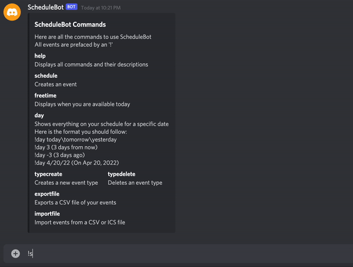
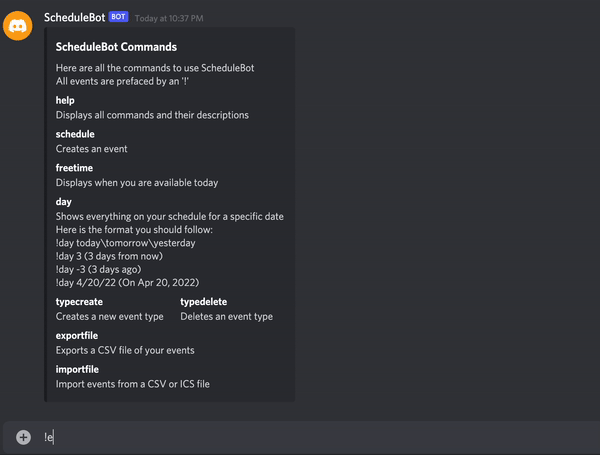
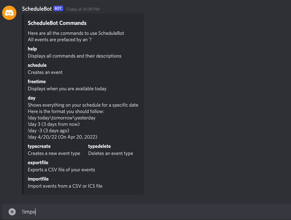
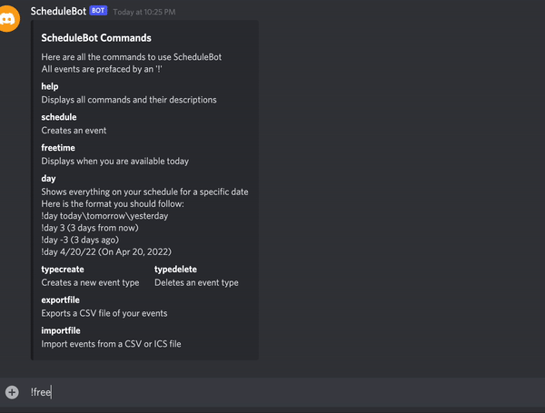
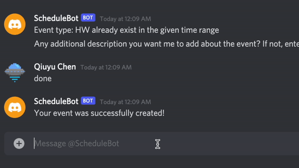

[](https://opensource.org/licenses/MIT)
[](https://zenodo.org/badge/latestdoi/419116957)
[](https://app.travis-ci.com/github/qchen59/ScheduleBot)

[](https://github.com/qchen59/ScheduleBot/issues)
[](https://github.com/qchen59/ScheduleBot/releases)
[](https://github.com/qchen59/ScheduleBot/releases)
[](https://discord.com/)
[](https://coveralls.io/github/qchen59/ScheduleBot?branch=main)

# ScheduleBot

> Don't let the fear of the time it will take to accomplish something stand in the way of your doing it. The time will pass anyway; we might just as well put that passing time to the best possible use. - Earl Nightingale


https://user-images.githubusercontent.com/34405372/139776326-722e8526-4977-4ffd-b00e-c86a8fd5f706.mp4


ScheduleBot is a Python application that helps you calendarize events and work through a Discord bot. Want to try it out? Simply follow the steps outlined in the [For Developers](#For-Developers) section. ScheduleBot can be configured to run on your Discord server by adding just one line of code!


With ScheduleBot you can quickly schedule events, state your prefered times for certain types of activities (exercise, homework, meetings, etc.) and quickly find out which times you have available to do more stuff.


## Getting started

To get a list of commands, DM the bot the command:

```
!help
```

The bot will reply back you with the list of available commands.


### **Scheduling an event**

ScheduleBot's unit of work is the **event**. When you use ScheduleBot to organize your activities, it keeps track of your registered events. Each event consists of a period of time, comprised between a starting and ending date/time, event type, event priority and optional notes.  

To schedule a new event, just DM the bot:

```
!schedule
```

The bot will ask you the details of your new event.



### **I forgot my agenda for the day**

You can take a look at your events scheduled for a specfic date with the command:

```
!day today(or tomorrow\yesterday)
```

```
!day 3 (3 days from now)
```

```
!day -3 (3 days ago)
```

```
!day 4/20/22 (On Apr 20, 2022)
```

The bot will show you what you have scheduled for the date. This includes events that start before, or end after this date.


### **I don't really want to work at 3 a.m.**

You can create custom event types to further organize your schedule. You can define your preferred times by creating a new event type:

```
!typecreate
```

The bot will ask you for the name of the type and your preferred times.


### Import & Export your calendar

You can import or export their calendar events as a CSV file through the bot. You can also import ICS files downloaded from Google Calendar.

```
!exportfile
```


```
!importfile
```
Then drag the file to the Schedulebot.



### Looking for the spare time?

ScheduleBot will help you find your free times. Just write:

```
!freetime
```


### Find available times for a type of event
When you look for available times, you now can use `!find` to find only the available times in your preferred hours. 



## For Developers

### Get your Discord bot 

 Follow this [tutorial](https://www.freecodecamp.org/news/create-a-discord-bot-with-python/) to create your discord bot account.

### Token
  To "login" to your bot through our program, place a file named `config.py` in your src directory with the content:
  
  ```
  token = ************(your discord bot token)
  ```
  
### Intall required packages
  ```
  pip install -r requirements.txt
  ```
### Run the schedulebot.py
  ```
  python3 schedulebot.py
  ```
  Then your scheduleBot should start working.
  
## Releases

-   [All releases](https://github.com/qchen59/ScheduleBot/releases)
-   [v1.1](https://github.com/lyonva/ScheduleBot/releases/tag/v1.1): First functional release
-   [v2.0](https://github.com/qchen59/ScheduleBot/releases/tag/v2.0.0): First version 2 release with import/export events function, find available time feature, also supports 24 hour time format and event priority.
-   [v2.1] (): Finalized version 2, check what's new in V2

# What's new in V2:

Please note that this is not an exhaustive list, however it does include all major improvements. For a complete list of all changes and bug fixes, please see our closed github issues or commit history.

#### Import & Export your calendar

The user can now import or export their calendar events as a CSV file through the bot. The user can also import ICS files downloaded from Google Calendar.

#### Find time based on schedule + preferred time

ScheduleBot can help you find available times for a type of event based on your schedule and preferred time for the event type.

#### Event types with priority

Users can now assign a priority value for each event. This will help them keep track of important events. It also provides a foundation for future improvements, such as suggesting event removals based on the priority of events.

#### Support 24-hour time format input

We support 24-hour time format input now, in addition to the 12-hour format.

#### User's files encryption/decryption

User's data is now encrypted when it is stored in the host server, so the host will not be able to see other users\' schedules as easily. This improves user's privacy when using Schedulebot.

#### Check schedule for arbitrary days 

Users are able to check the schedule for any specific day in addition to today. Previously, only the events occurring today could be retrieved by the user.

#### Code coverage improvement

In this version, we improved the project's code coverage from 39% to 54%.

Code coverage remains low in this project because many sections of code require a Discord channel, and responses from a non-bot user through Discord. However, we were able to create a mock discord channel and user for several tests by using the "dpytest" library.

#### Fixed bugs related to the welcome message sent at startup

At startup, the bot now sends an on_ready welcome message to all servers the bot is currently listening to, instead of just one specific server. The bot also no longer attempts to respond to reactions to the welcome message made by itself or other bots.

#### Fixed bugs related to finding freetime

!freetime function was not working under certain circumstances, such as when there was only one event in the schedule. This has been fixed in the latest version.

## Getting involved

Thank you for caring for this project and getting involved. To start, please check out [contributing](https://github.com/qchen59/ScheduleBot/blob/main/CONTRIBUTING.md) and [code of conduct](https://github.com/qchen59/ScheduleBot/blob/main/CODE_OF_CONDUCT.md). For more technical detail of implementation of code, you can check out the documentation. When you want to get your hands on the project, take a peek into the [github project](https://github.com/qchen59/ScheduleBot/projects/1), assign yourself a task, move it to To-Do, and convert it into an issue and assign it to yourself.

Check out the [internal documentation](https://htmlpreview.github.io/?https://github.com/qchen59/ScheduleBot/blob/main/docs/src/index.html) if you want to contribute or find out about the inner workings of ScheduleBot.

## Future features

These are example features that could be added to ScheduleBot in the future.

### Delete event
Delete the event you don't want anymore:

```
!eventdelete
```

### Suggest event removals
When Your entire day is scheduled
You have event 1 of priority 4
You try to find time for another event of priority 3
ScheduleBot should say there is no time, but can suggest replacing event 1 as it has less priority.

### Edit event
You can edit the event you created:

```
!eventedit
```

### Quick event creation

You can quickly create a new event with the command

```
!schedulefind type X
```

It will find and schedule the first available X contiguous hours, on your preferred hours of the specified `type`.
